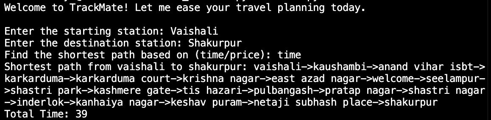
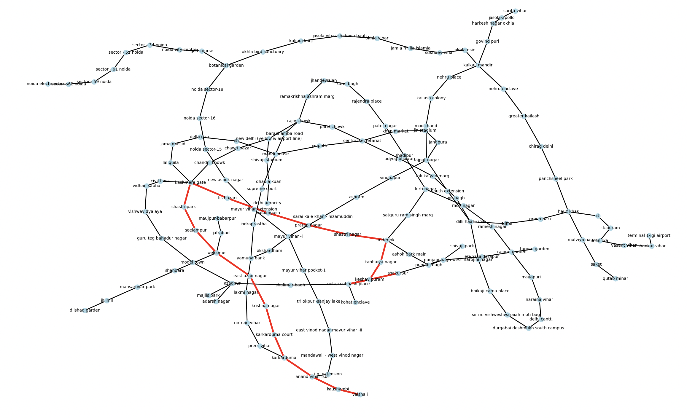

# TrackMate
 

A project to help hundreds of daily Delhi-metro users find the best metro path based on their requiremnts.

**TrackMate** is a Python-based **Shortest Path Finder** for metro and bus routes. Users can input a starting and ending station and 
get the **optimal route based on time or price**. It visualizes the path using **NetworkX** and **Matplotlib**. 
The project is designed to showcase **DSA (Dijkstra's Algorithm)** implementation, **graph theory**, and **Python visualization**.

## What makes TrackMate Special?
- **Shortest Path on Choice**: Users can choose the shortest path based on time or price.
- **Path Visualisation**: The path is visualised using NetworkX and Matplotlib.
- **DSA in Action**: Uses Dijkstra's algorithm to compute shortest paths efficiently.

## Usage
1. Input the source station.
2. Input the destination station.
3. Choose whether to prioritize time or price. 
4. View the calculated path and the distance. 

Terminal when the program is running

 
The shortest path is highlighted in red

## Tech Stack
TrackMate was built with the following technologies:
- Python 3.9+ - The core programming language
- NetworkX -  For creating and visualising the graph of stations
- Pandas - For CSV manipulation and data handling
- Matplotlib - For visualising the shortest path on the graph

## Upcoming Features
Here is a sneak-peek into the upcoming features in TrackMate:
- Graphical User Interface with Tkinter for easy user access.
- Addition of more stations in the Delhi-metro network.
- Addition of bus routes for a more comprehensive journey planning.

## Installation

> git clone https://github.com/aadya-gupta/TrackMate
>
> pip install -r requirements.txt
>
> python find.py

## Note
A short note on what some special files include:
- bmp_metro.png: A part of the Delhi-metro network map. The project runs on the given stations.
- metro_stations.csv: A CSV of all the stations that the project runs on, it includes the columns - "From", "To", "Price", "Time".

